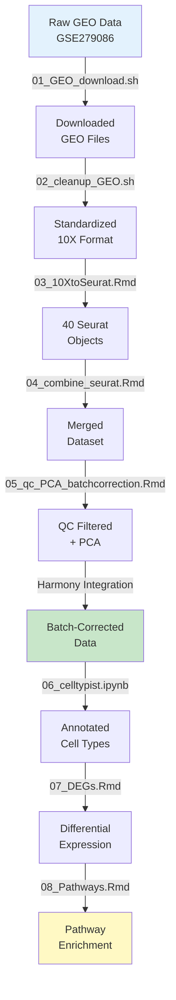

# Single-Cell RNA-seq Analysis of GSE279086

[](https://www.r-project.org/)
[](https://www.python.org/)
[](LICENSE)
[](https://www.ncbi.nlm.nih.gov/geo/query/acc.cgi?acc=GSE279086)

**Author:** Abdul Kader Ibrahim  
**Date:** 2026-03-05

---

## Pipeline Status

| Step | Script | Status |
|------|--------|--------|
| 01 | GEO Download | ✅ Complete |
| 02 | GEO Cleanup | ✅ Complete |
| 03 | 10X to Seurat | ✅ Complete |
| 04 | Combine Seurat Objects | ✅ Complete |
| 05 | QC, PCA & Batch Correction | ✅ Complete |
| 06 | Cell Type Annotation | 🔜 In Progress |
| 07 | Differential Expression | 🔜 Planned |
| 08 | Pathway Enrichment | 🔜 Planned |

---

## Overview

This repository presents a **reproducible, end-to-end workflow** for analyzing single-cell RNA-seq data from kidney biopsies in Type 1 Diabetes (T1D). The pipeline is modular, well-documented, and designed for clarity, reproducibility, and professional presentation.

### Dataset Information

- **GEO Accession:** [GSE279086](https://www.ncbi.nlm.nih.gov/geo/query/acc.cgi?acc=GSE279086)
- **Technology:** 10x Genomics single-cell 3' RNA-seq
- **Samples:** 40 kidney biopsies (20 Control, 20 Type 1 Diabetes)
- **Organism:** *Homo sapiens*
- **Focus:** Early transcriptional changes in diabetic kidney disease

### Scientific Question

**How do different kidney cell types respond transcriptionally to early Type 1 Diabetes?**

This analysis identifies cell-type-specific gene expression changes and dysregulated pathways before structural kidney damage occurs, providing insights into early diabetic nephropathy mechanisms.

---

## Analysis Workflow



---

## Workflow Details

### 01. GEO Download

**Script:** `01_GEO_download.sh`

**Purpose:** Automates retrieval of raw GEO matrices from NCBI.

**Key Features:**
- Maps each GSM accession to sample IDs
- Downloads raw count matrices
- Ensures reproducibility with exact file versions

**Output:** Raw GEO files organized by sample

---

### 02. GEO Cleanup

**Script:** `02_cleanup_GEO.sh`

**Purpose:** Standardizes GEO folder structure to 10x Genomics format.

**Key Features:**
- Converts to `barcodes.tsv.gz`, `features.tsv.gz`, `matrix.mtx.gz` format
- Removes pre-processed files to ensure raw-data workflow
- Validates file integrity

**Output:** Clean 10x-compatible directories

---

### 03. 10X to Seurat

**Script:** `03_10XtoSeurat.Rmd`

**Purpose:** Converts raw count matrices into Seurat objects.

**Key Features:**
- Minimal filtering (removes empty droplets)
- Computes QC metrics (mitochondrial %, ribosomal %)
- Preserves metadata (sample IDs, condition labels)
- Initial cell-level statistics

**Output:** 40 individual Seurat objects (`.rds` files)

---

### 04. Combine Seurat Objects

**Script:** `04_combine_seurat.Rmd`

**Purpose:** Merges all 40 Seurat objects into a unified dataset.

**Key Features:**
- Harmonizes metadata across samples
- Generates exploratory plots (cell counts, QC distributions)
- Validates dataset integrity

**Output:** Single merged Seurat object

---

### 05. QC, PCA & Batch Correction

**Script:** `05_qc_PCA_batchcorrection.Rmd`

**Purpose:** Multi-layered quality control and dimensionality reduction.

**QC Strategy:**
- **Gene count filtering:** Remove empty droplets and doublets
- **Mitochondrial fraction:** Filter stressed/dying cells (<20%)
- **Ribosomal fraction:** Remove low-information cells (<50%)
- **Mahalanobis distance:** Detect multivariate outliers

**Normalization & Integration:**
- SCTransform normalization
- Variable feature selection
- PCA (30 dimensions)
- UMAP embedding
- **Harmony batch correction** to remove technical variation

**Outputs:**
- QC summary tables
- Batch-corrected Seurat object (`.rds`, `.h5seurat`, `.h5ad`)
- UMAP coordinates
- QC visualization plots

**Key Result:** [Pre-QC and Post-QC Plots.pdf](Pre-QC%20and%20Post-QC%20Plots.pdf)

---

### 06. Cell Type Annotation (In Progress)

**Script:** `06_celltypist_GSE279086.ipynb`

**Purpose:** Annotate cell types using CellTypist with kidney reference.

**Planned Analyses:**
- Automated cell type prediction
- UMAP visualization by condition (Control vs T1D)
- Cell composition analysis
- Identification of cell type shifts

**Expected Outputs:**
- Annotated `.h5ad` object
- Cell type proportion tables
- UMAP plots colored by cell type and condition

---

### 07. Differential Expression Analysis (Planned)

**Script:** `07_DEGs_GSE279086.Rmd`

**Purpose:** Identify transcriptional changes within cell types.

**Planned Methods:**
- MAST differential expression testing
- Cell-type-specific Control vs T1D comparisons
- Multiple testing correction (FDR < 0.05)

**Expected Outputs:**
- DEG tables per cell type
- Volcano plots
- Heatmaps of top differentially expressed genes

---

### 08. Pathway Enrichment (Planned)

**Script:** `08_Pathways_GSE279086.Rmd`

**Purpose:** Connect DEGs to biological processes and pathways.

**Planned Methods:**
- Reactome pathway enrichment
- KEGG pathway analysis
- Gene Set Enrichment Analysis (GSEA)

**Expected Findings:**
- Metabolic pathway remodeling
- Vascular signaling alterations
- Cell-type-specific pathway dysregulation

---

## Installation & Setup

### Prerequisites

- **R:** >= 4.2.0
- **Python:** >= 3.8
- **Disk Space:** ~50 GB for raw data
- **RAM:** 16 GB minimum (32 GB recommended)

### Quick Start

#### 1. Clone the Repository

```bash
git clone https://github.com/mimakbio-cpu/scRNAseq-kidney-diabetes-GSE279086-.git
cd scRNAseq-kidney-diabetes-GSE279086-
```

#### 2. Set Up Conda Environment

```bash
conda env create -f environment.yml
conda activate scrna_kidney
```

#### 3. Install R Dependencies

Open R console and run:

```r
# CRAN packages
install.packages(c("Seurat", "harmony", "ggplot2", "dplyr", "tidyr"))

# Bioconductor packages
if (!require("BiocManager", quietly = TRUE))
    install.packages("BiocManager")
BiocManager::install(c("scater", "scran"))
```

#### 4. Download and Process Data

```bash
# Download raw GEO data
bash 01_GEO_download.sh

# Clean and standardize
bash 02_cleanup_GEO.sh
```

#### 5. Run Analysis Pipeline

```bash
# Execute R Markdown scripts sequentially
Rscript -e "rmarkdown::render('03_10XtoSeurat.Rmd')"
Rscript -e "rmarkdown::render('04_combine_seurat.Rmd')"
Rscript -e "rmarkdown::render('05_qc_PCA_batchcorrection.Rmd')"
```

### Expected Runtime

- Data download: ~2-4 hours
- QC & integration: ~1-2 hours  
- Cell typing: ~30 minutes  
- **Total:** ~4-7 hours

---

## Key Results & Interpretation

### Quality Control

**Multi-layered QC successfully removed low-quality cells**
- Applied gene count, mitochondrial fraction, ribosomal fraction filters
- Mahalanobis distance outlier detection for subtle quality issues
- Retained high-confidence cells for downstream analysis

### Batch Correction

**Harmony integration reduced technical variation**
- Successfully merged 40 samples
- Preserved biological structure while removing batch effects
- Generated coherent UMAP clusters

### Anticipated Findings (Steps 06-08)

**Cell Type Composition:**
- Expected remodeling of endothelial and tubular compartments
- Possible reduction in podocyte populations in T1D samples

**Differential Expression:**
- Anticipated transcriptional shifts in principal cells and vascular endothelium
- Cell-type-specific responses to diabetic stress

**Pathway Enrichment:**
- Predicted enrichment in oxidative metabolism pathways
- Vascular signaling alterations consistent with early diabetic kidney stress

---

## Repository Structure

```
scRNAseq-kidney-diabetes-GSE279086/
├── README.md                              # This file
├── environment.yml                        # Conda environment specification
├── 01_GEO_download.sh                    # Download GEO data
├── 02_cleanup_GEO.sh                     # Standardize file format
├── 03_10XtoSeurat.Rmd                    # Create Seurat objects
├── 04_combine_seurat.Rmd                 # Merge datasets
├── 05_qc_PCA_batchcorrection.Rmd        # QC and integration
├── 06_celltypist_GSE279086.ipynb        # Cell type annotation (upcoming)
├── 07_DEGs_GSE279086.Rmd                # Differential expression (upcoming)
├── 08_Pathways_GSE279086.Rmd            # Pathway enrichment (upcoming)
└── Pre-QC and Post-QC Plots.pdf         # QC visualization results
```

---

## Methods & Tools

### Quality Control Criteria

| Metric | Threshold |
|--------|-----------|
| Genes detected | 200 - 7,000 |
| UMI counts | 500 - 50,000 |
| Mitochondrial content | < 20% |
| Ribosomal content | < 50% |
| Outlier detection | Mahalanobis distance (chi-squared test, p < 0.01) |

### Computational Methods

- **Normalization:** SCTransform with Pearson residuals
- **Batch Correction:** Harmony (theta = 2)
- **Dimensionality Reduction:** PCA (30 dimensions)
- **UMAP Parameters:** neighbors = 30, min_dist = 0.3
- **Clustering:** Louvain algorithm (resolution TBD)

### Software Versions

- **Seurat:** 5.0.1
- **Harmony:** 1.0
- **CellTypist:** 1.6.2 (planned)
- **R:** 4.3.0
- **Python:** 3.10.0

---

## Roadmap

- [x] Data download and preprocessing
- [x] Quality control and batch correction
- [ ] Cell type annotation with CellTypist
- [ ] Differential expression analysis
- [ ] Pathway enrichment analysis
- [ ] Interactive visualization (Shiny app)
- [ ] Cell-cell communication analysis
- [ ] Integration with published kidney atlases

---

## Citation

If you use this workflow in your research, please cite:

```
Ibrahim, A. K. (2026). Single-cell RNA-seq Analysis Workflow for GSE279086. 
GitHub: https://github.com/mimakbio-cpu/scRNAseq-kidney-diabetes-GSE279086-
```

**Original Dataset Citation:** (Will be added upon publication)

---

## License

This project is licensed under the MIT License - see the [LICENSE](LICENSE) file for details.

---

## Author

**Abdul Kader Ibrahim**  
NGS Lab Scientist | Bioinformatics Researcher

- **Email:** mimak.bio@gmail.com
- **LinkedIn:** [linkedin.com/in/dnaseq](https://linkedin.com/in/dnaseq)
- **GitHub:** [@mimakbio-cpu](https://github.com/mimakbio-cpu)

*Passionate about single-cell genomics, disease modeling, and reproducible computational workflows.*

---

## Contributing

Contributions, issues, and feature requests are welcome! Feel free to check the [issues page](../../issues).

---

## Acknowledgments

- Dataset from GEO accession GSE279086
- Built with Seurat, Harmony, and the R/Bioconductor ecosystem
- Inspired by best practices in single-cell analysis workflows

---

**Last Updated:** March 7, 2026
